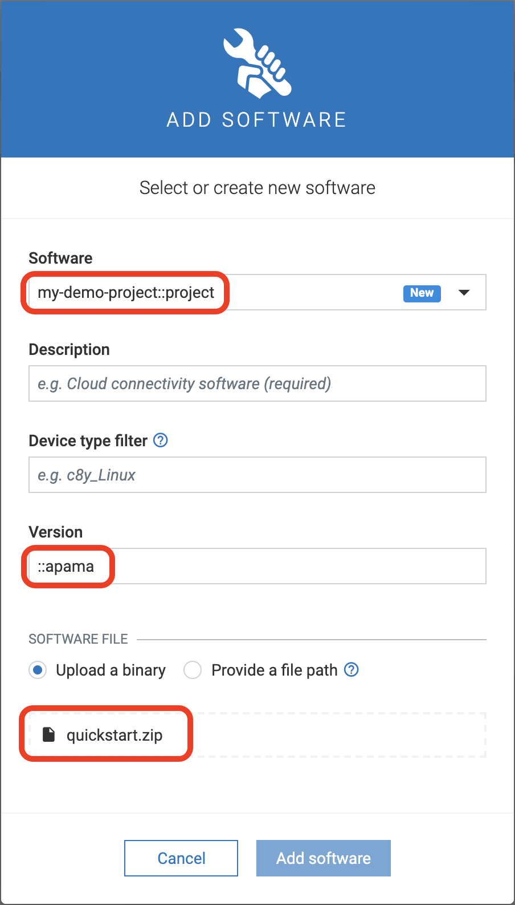

# Apama Software Management Plugin

The Apama plugin, part of the Apama thin-edge support package, can be used to install Apama projects using the Cumulocity software management feature.

## Add the Apama thin-edge support package to the tenant software repository and deploy it to thin-edge

1. In the **Device Management** app and go to the **Management** menu option and select the **Software repository**.
2. Click **Add software** at the right of the top menu bar.
3. In the **ADD SOFTWARE** dialog enter the following details:
    - **Software**: apama-thin-edge-support
    - **Description**: apama-thin-edge-support (or something else if you choose)
    - **Device Filter Type**: (leave empty)
    - **Software Type**: apt
    - **Version**: 10.15.1.0-1::apt
    - **SOFTWARE FILE**: select the **Provide a file path** option and give an **empty space** (' ').
4. Click the **Add Software** button.
5. Now return to the **Devices** menu option and then select **All devices**.
6. In the list of devices, select the thin-edge device installed previously.
7. In the sub-menu for the device, select the **Software** option.
8. Click the **Install software** button in the bottom left; the apama-thin-edge-support should be listed.
9. Click the drop-down arrow on the right and check the 10.15.1.0-1::apama radio button, then click **Install**.
10. Finally, click the **Apply changes** button in the lower right of the panel.

After installation of the support for Apama onto the thin-edge device, the correlator will attempt to start, but will fail initially because there is not yet an Apama project installed. Instructions are given below for installing an Apama project on the device.

## Install Apama artifacts from Cumulocity

Before an Apama project can be installed on the device using the software management feature in Cumulocity, the project files need to be added to the Cumulocity software repository.

There is a naming convention that you need to follow while creating software entries for Apama artifacts in the software repository.

For Apama projects:

1. The name must be suffixed with `::project` as in `my-demo-project::project`.
2. The version must be suffixed with `::Apama` as in `1.0::Apama` or just `::Apama` if no  version number is necessary.
3. The uploaded binary must be a `zip` file that contains the `project` directory. If a directory named `project` is not found by the plugin at the root level in the zip, it is considered invalid.



Once the software modules have been added to the software repository, these can be installed on the device just like any other software from the `Software` tab of the device in the Cumulocity device UI.

### Testing Apama Plugin

Here is an Apama project that you can use to test this plugin.

[project zip](https://github.com/thin-edge/thin-edge.io/raw/main/tests/PySys/plugin_apama/Input/quickstart.zip)

Add this project as a software package in the Cumulocity software repository by following the instructions in the previous section.
Once added, this Apama project can be installed on any target device.
You can test if the project was successfully installed by running the following Apama command:

```shell
/opt/softwareag/Apama/bin/apama_env engine_inspect -m
```

You can expect an output like this:

```console
Monitors
========
Name                                               Num Sub Monitors
----                                               ----------------
TedgeDemoMonitor                                             1
```

You can find more information on this test Apama project [here](https://github.com/thin-edge/thin-edge.io_examples/tree/main/StreamingAnalytics#testing-a-project).
